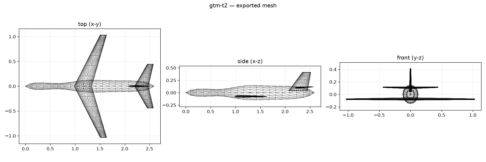

# 2026-08-22 — GTM T-2 capstone

- Type: capstone
- Window: 2026-08-21 23:12–2026-08-22 07:58
- Commits: `0a73e35`, `cb34391`
- Replaces: `docs/gtm-t2-capstone-report.md`

NASA's GTM T-2 was the first design-input-only aircraft reproduction. It began
as a blind attempt, failed, and then became a useful post-hoc verification case
after its residuals exposed general model and pipeline defects.

## Evidence boundary

- Source: NASA `GTM_DesignSim`, revision
  `9717143270144aca1f5d38d7c24c0fce678d1589`.
- Truth class: C, because the released coefficients are sampled polynomial
  simulation tables derived from a restricted tunnel database, not raw
  experimental measurements.
- Final role: verification. The first run was blind, but its failed residuals
  informed later implementation, so no rerun can recover untouched holdout
  status.
- The truth values, uncertainty model, and acceptance limits remained frozen.
  A provenance audit removed the 960 s AirSTARsim timer because it was an
  operational input already visible to the designer, not measured endurance.

The design agent initially received only public geometry, mass, propulsion,
mission requirements, and declared abstractions. It authored `designs/gtm-t2`
and ran the canonical pipeline without the hidden polynomial table, derived
slopes, neutral point, trim, L/D, or score margins.

## What the failed attempt changed

- Source-locked reproduction froze reference geometry, fuel, mass, and CG
  instead of resizing a known aircraft.
- Multi-surface OAS adopted main-wing reference area and explicit section
  CLmax conversion; twin external engines became pods rather than fuselage
  packing volume.
- A same-run VSPAERO wing/body/nacelle term supplied body-sensitive stability
  evidence, while geometry and finite-wing theory supplied the tail term.
- Reproduction MDO became deterministic trim closure instead of free aircraft
  optimization.
- Correcting twice-diameter nacelles exposed excessive tail authority. A
  declared 0.82 tail-effectiveness calibration was derived from separate
  Class-B NASA 14x22 tail-damage/static-margin evidence plus same-run
  VSPAERO. It is disclosed calibration, not a predicted observable.
- OAS leading-edge sweep mapping, mass closure, signed ±g inertia, and refusal
  of extrapolative load shapes/FEM fallbacks were corrected.
- Same-phase hybrid constants became hash-bound to their serialized VSP3.

## Outcome

The frozen Class-C scorecard passed all 12 observables within 2u, with mean
`|r|/u = 0.405` and maximum `1.444`:

- lift slope 0.08741 versus 0.08645 per degree;
- neutral point 0.5487 versus 0.5728 MAC;
- correct static-stability sign;
- trim angle 6.563° versus 5.596°;
- trimmed OAS L/D 10.463 versus 9.440;
- stall speed 27.677 versus 28.643 m/s; and
- effectively exact declared mass, span, area, MAC, fuselage length, and
  geometry requirement.

The delivered aircraft also passed 12/12 internal gates. Those gates prove
closure under encoded models; this scorecard proves agreement only with this
released engineered reference inside its frozen allowances. Component-model
neutral point differed from full-vehicle VSPAERO by 0.197 MAC, while OAS
differed by 0.097 MAC; both spreads remain diagnostics rather than independent
passes.

## Claim boundary

This is successful post-hoc reproduction of a NASA system model, not physical
aircraft validation. It supports this GTM geometry's attached-flow lift,
longitudinal stability, trim, conceptual drag/stall, and source-locked closure
only. It makes no measured-endurance or broad robustness claim, and a fresh
independent holdout would be required for validation.
